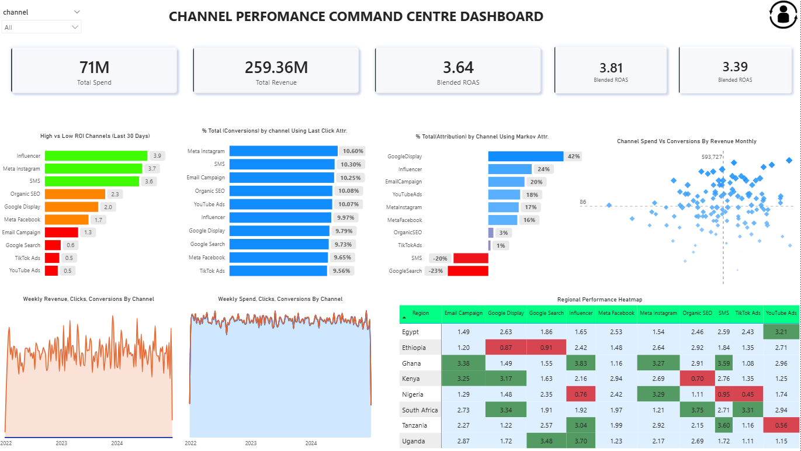
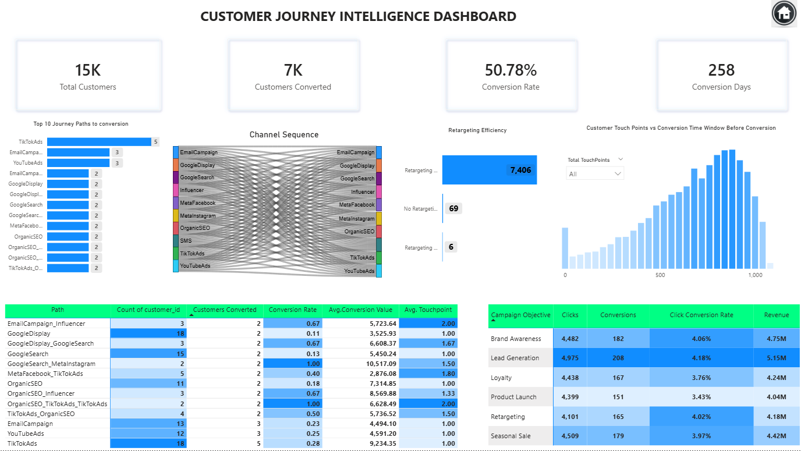
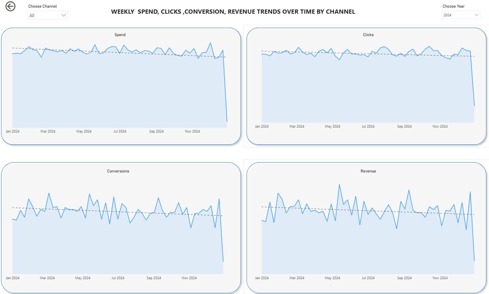

# Multi-Channel Marketing Attribution & ROI Optimization

## 1. Project Overview

This project presents an end-to-end marketing analytics system designed to evaluate channel performance and optimize return on investment (ROI) using data-driven methods.

The solution combines Markov Chain attribution modeling with machine learning-based revenue prediction to provide a comprehensive view of marketing effectiveness and support better budget allocation decisions.

---

## 2. Business Problem

Modern marketing campaigns span multiple channels, making it difficult to determine which touchpoints truly drive conversions and revenue.

Traditional attribution methods such as last-click fail to capture the complexity of customer journeys, often leading to inaccurate insights and inefficient marketing spend.

This project addresses this challenge by leveraging probabilistic modeling and machine learning to better understand channel contribution and predict revenue outcomes.

---

## 3. Objectives

* Quantify channel contribution using a data-driven attribution model
* Predict revenue based on campaign performance metrics
* Capture non-linear relationships in marketing data
* Identify key drivers of revenue and efficiency
* Support ROI-driven decision-making

---

## 4. Dataset Description

The dataset consists of:

* Customer journey data (multi-channel touchpoints)
* Campaign performance metrics (spend, impressions, clicks)
* Aggregated weekly campaign data

These datasets were processed and transformed into structured inputs for attribution modeling and predictive analysis.

---

## 5. Methodology

### 5.1 Data Preparation

* Aggregated customer journeys into sequential paths
* Cleaned and standardized channel naming
* Structured weekly campaign-level dataset

---

### 5.2 Markov Chain Attribution Model

* Modeled customer journeys as state transitions
* Built transition probability matrices
* Calculated removal effects to estimate channel contribution

---

### 5.3 Feature Engineering

Key features developed include:

* Spend-based metrics (weekly spend, campaign spend)
* Engagement metrics (clicks, impressions, CTR)
* Efficiency metrics (CPA, CPC, CPM)
* Encoded categorical variables (channel, campaign objective, region)

---

### 5.4 Model Development

Models trained and evaluated:

* Linear Regression
* Ridge Regression
* Lasso Regression
* Random Forest Regressor ✅ (best performer)

---

## 6. Model Performance

| Model         | R² (Test) | RMSE     | Notes                             |
| ------------- | --------- | -------- | --------------------------------- |
| Ridge/Lasso   | ~0.32     | Moderate | Limited by linear assumptions     |
| Random Forest | ~0.79     | ~20K     | Captures non-linear relationships |

* Implemented time-aware validation (`shuffle=False`)
* Reduced overfitting through hyperparameter tuning

---

## 7. Feature Insights

Top drivers of revenue:

* weekly_cpa (dominant efficiency metric)
* weekly_spend_KES
* weekly_impressions

Key finding:
Efficiency metrics (e.g., CPA) are significantly more predictive of revenue than raw engagement or channel variables.

---

## 8. Key Insights

* Customer journeys are non-linear and require probabilistic modeling
* Efficiency metrics outperform exposure-based metrics in predicting revenue
* Tree-based models significantly outperform linear models in marketing data
* Proper validation (time-based split) is critical for realistic performance

---

## 9. Challenges

* Handling multi-channel sequential journey data
* Avoiding target leakage from derived metrics
* Managing skewed revenue distribution
* Balancing model interpretability vs predictive performance

---

## 10. Conclusion

This project demonstrates how combining Markov attribution with machine learning provides a more complete understanding of marketing performance.

It highlights the importance of both attribution (who drives conversions) and prediction (how much revenue is generated) in building effective ROI optimization systems.

---

## Project Structure

```
/marketing-attribution-roi-optimization
│
├── README.md
├── /data
├── /notebooks
└── /dashboard
```

## Future Work

* Budget optimization simulator

---
## Dashboard Preview



---


---


